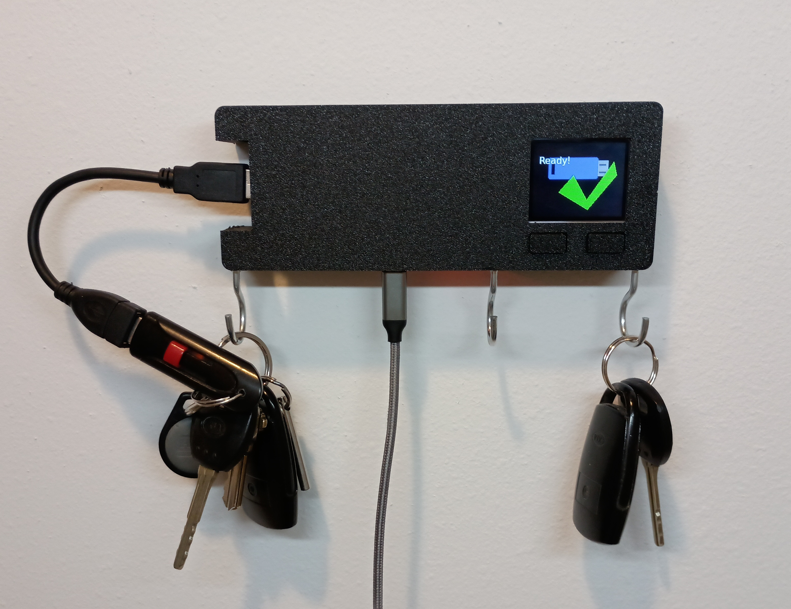
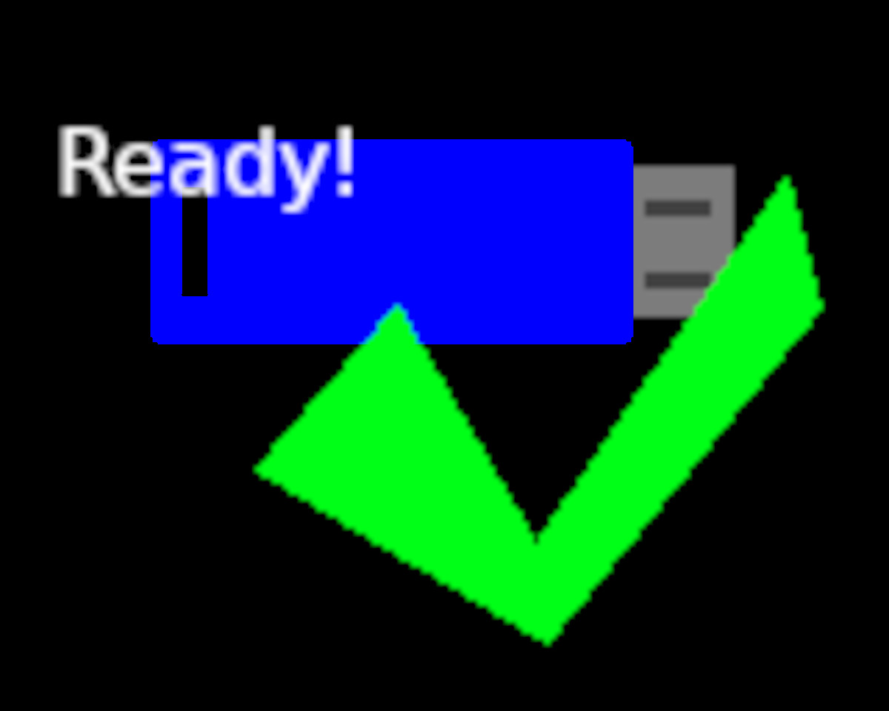
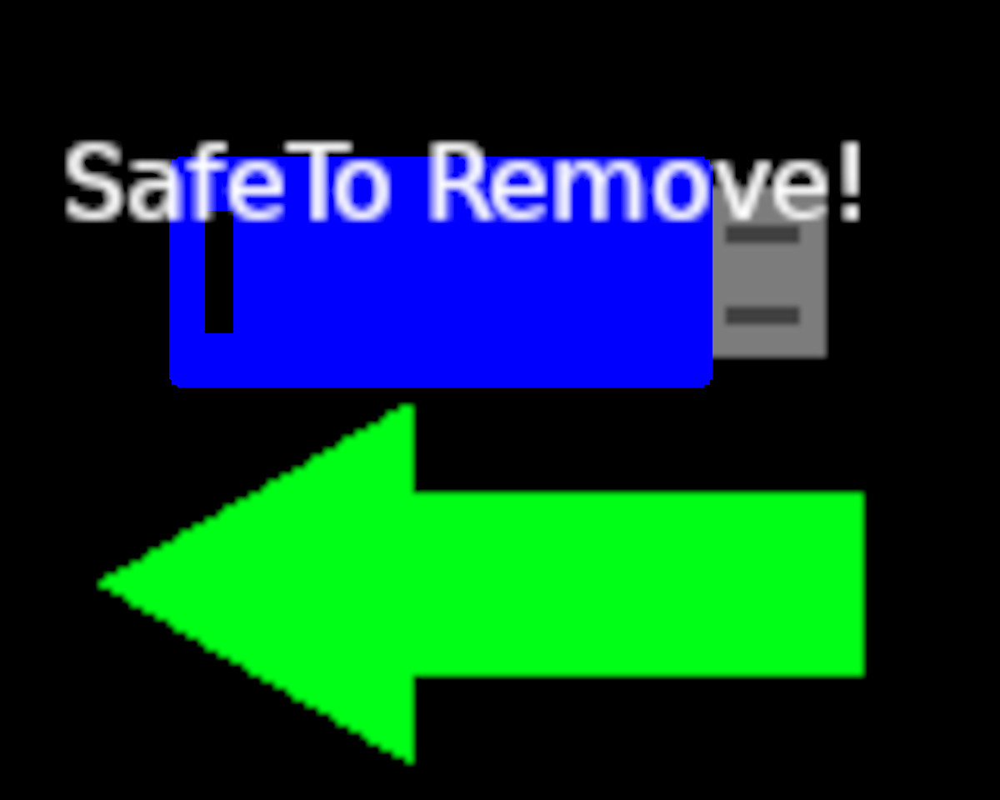

# keychain_backup_pi

## What is Keychain Backup Pi?

 

This project is a backup system that allows keeping your important files with you all the time! Simply plug in your USB drive when you hang up your keys at night, backups run overnight over wifi, and in the morning take your freshly backed up files when you grab your keys. All powered by that amazing linux SBC, the raspberry pi.

## Improvements in this version:

* OLED LCD to give status and feedback.
* 2 buttons for interaction.
* Faster backups, 5-8 Mbytes/sec
* Easier access to the USB drive, using an extension cable.

## How it works:

Plug in you USB drive into the USB extension cable and hang your keys on a hook.

The LCD will display Ready! when the drive is ready for backups.

Let backups run over night.

In the morning when you are ready to take your keys, press one of the buttons on the front of the case. After a few moments, the LCD will show Safe to remove. Unplug the usb drive and take your keys.

## Setup

1. Follow the steps in [image flashing](documentation/imageFlashing.md) to get your sdcard setup with the keychain backup image.
2. If you aren't using the kit, [build from scratch](documentation/buildingFromScratch.md).
3. [Assemble the hardware](documentation/assembly.md).
4. [Mount it on the wall](documentation/mounting.md).

Finally, setup backups:

[Setup Duplicati for Windows, Mac and Linux](documentation/duplicatiSetup.md)

[Android file syncing instructions](documentation/androidSync.md)

[iPhone file syncing instructions](documentation/iphoneSync.md)

------------------
Please Note:

THE SOFTWARE IS PROVIDED “AS IS”, WITHOUT WARRANTY OF ANY KIND, EXPRESS OR IMPLIED, INCLUDING BUT NOT LIMITED TO THE WARRANTIES OF MERCHANTABILITY, FITNESS FOR A PARTICULAR PURPOSE AND NONINFRINGEMENT. IN NO EVENT SHALL THE AUTHORS OR COPYRIGHT HOLDERS BE LIABLE FOR ANY CLAIM, DAMAGES OR OTHER LIABILITY, WHETHER IN AN ACTION OF CONTRACT, TORT OR OTHERWISE, ARISING FROM, OUT OF OR IN CONNECTION WITH THE SOFTWARE OR THE USE OR OTHER DEALINGS IN THE SOFTWARE.

