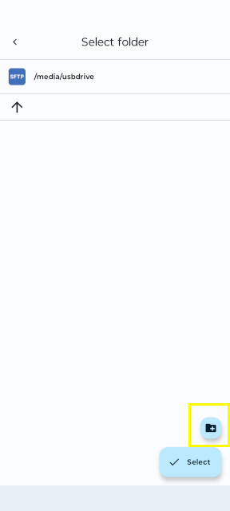

## Using FolderSync app to sync files from Android to keychain backup

Before running this setup doc, make sure the USB drive is inserted into your Keychain backup device.

Install FolderSync app from the Play Store.

-----

1. Click create folderpair button.

2. Give the folderpair a name and click next.

3. Leave Sync engine v2 selected and click next.

4. Select To right folder and click next.

5. On the Sync folders click on Select folder under Left folder.

6. Select the folder to be backed up. For pictures and videos on Android, that would be the DCIM folder. Then click Select.

7. Back at the Sync folders screen, under Right folder click on SD CARD.

8. Click Add account.

9. Scroll to the bottom and select SFTP under File protocols.

10. Click on the little pencil in the upper right corner and give the account a name.

11. Under login, enter the username and password you used to setup the raspberry pi.

12. Under Connection, in the server address box, put in the IP address or host name of the keychain backup device and in the Port box put 2222.

13. Once all the info has been entered, click the back arrow in the upper left corner.

14. Back at the Sync folders screen, click on the SD CARD button under Right folder again. Select the newly created host.

15. In the Select folder window, click media, then click usbdrive.

16. Then click the Add folder button in the lower right corner.

17. In the create folder screen, enter a descriptive name for this backup storage location. This will allow mulitple android devices to backup to this USB drive.

18. Then click on the newly created folder.

19. Finally click on Select button.

20. Then click Next on the Sync folders screen.

21. Then click save.

22. To run the sync operation, click Sync.

23. To schedule syncs, click the Scheduling button.

24. Then click + schedule.

25. After setting up the schedule click save.

26. To verify that files are syncing, after the sync finishes, safely remove the usb drive and plug it into a computer. Open a file browser window and go to the usb device folder. Verify that the expected files are there.

