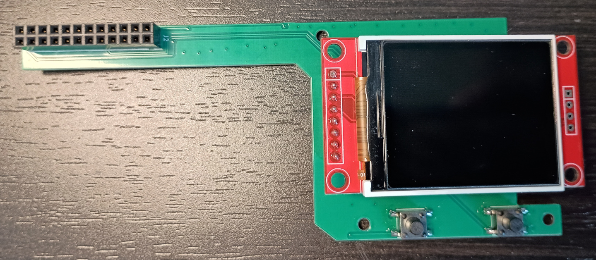
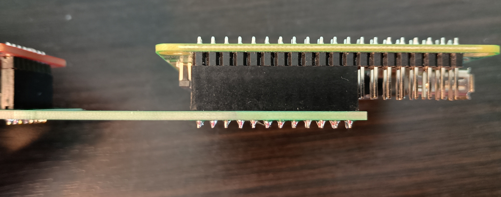
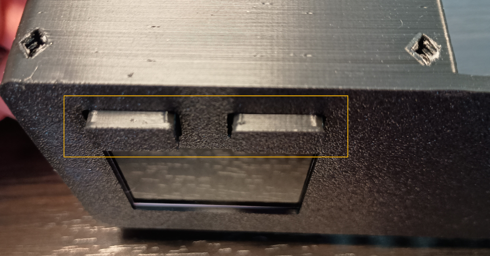
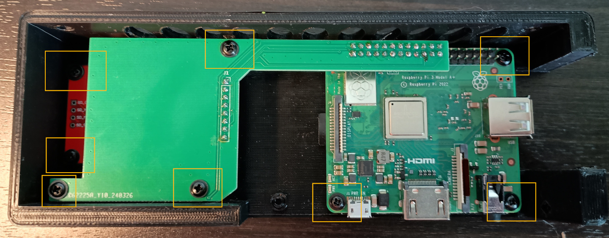
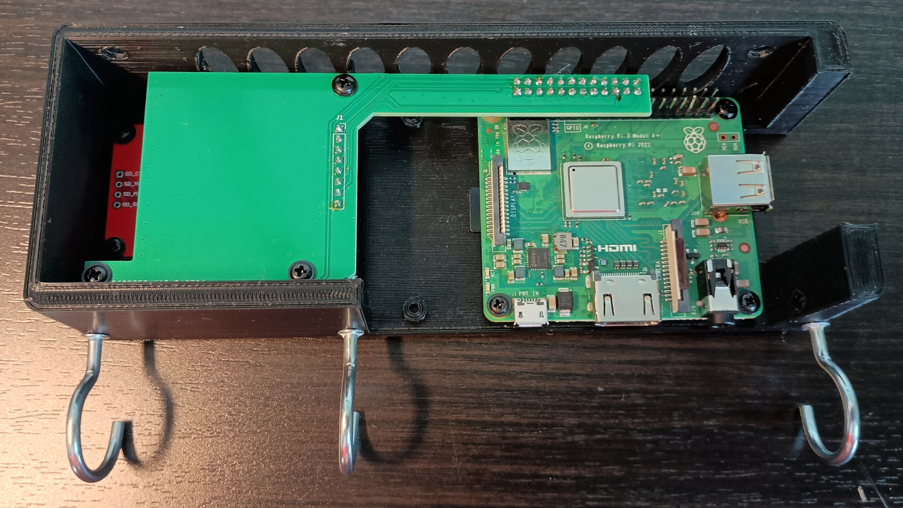

# Hardware Assembly

1. Plug in OLED LCD into 8 pin connection on the PCB.

2. Attach PCB to Raspberry pi expansion port.
   

   

   
3. Screw in OLED LCD, PCB and Raspberry pi into the case. Be aware the buttons need to stick out of the case while screwing in the pcb.

4. Screw in hooks to bottom of case.

Now onto mounting the case on the wall: [Mounting the case](mounting.md)
