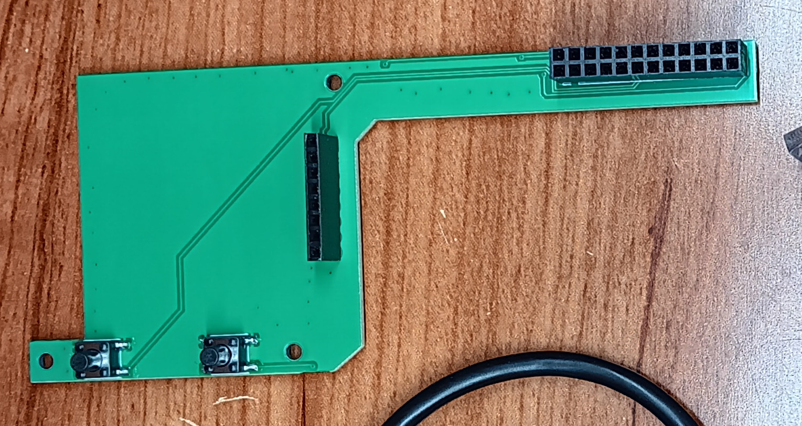

# Building from Scratch

Get one of the connector PCB's made:

Raspberry pi 3a+ gerbers [hardwarefiles/pcb/pi3a](https://github.com/thinklearndo/keychain_backup_pi/tree/main/hardwarefiles/pcb/pi3a)

Raspberry pi 3b+ gerbers [hardwarefiles/pcb/pi3b](https://github.com/thinklearndo/keychain_backup_pi/tree/main/hardwarefiles/pcb/pi3b)

### Parts needed to finish the PCB:

2x 6x6x8mm SMD normally open SPST Momentary tactile switches (something like DTSM-65N-V-B, [mouser link](https://www.mouser.com/ProductDetail/Diptronics/DTSM-65N-V-B?qs=gTYE2QTfZfSXwXAGPNekUg%3D%3D))

1x 1x8 2.54mm pitch female header

1x 2x12 2.54mm pitch female header

### Other parts needed:

1x 1.8" oled lcd spi (here's one on [amazon](https://www.amazon.com/Display-Module-ST7735-128x160-STM32/dp/B07BFV69DZ/ref=pd_aw_sbs_m_sccl_1/139-2968028-6826046?psc=1&pd_rd_i=B07BFV69DZ&psc=1))

3x 1.25" Screw-in Cup Hooks

2x #6 screws and drywall mounts

2x m4x5mm screws

8x m2.6x4mm screws

Solder headers and buttons onto board:

### Make the case:

Print out the [case](https://github.com/thinklearndo/keychain_backup_pi/blob/main/hardwarefiles/stl/keychain%20case.stl)

Print out the [wall bracket](https://github.com/thinklearndo/keychain_backup_pi/blob/main/hardwarefiles/stl/wall%20mount.stl)

Now you're ready to do the [hardware assembly](https://github.com/thinklearndo/keychain_backup_pi/blob/main/documentation/assembly.md)
