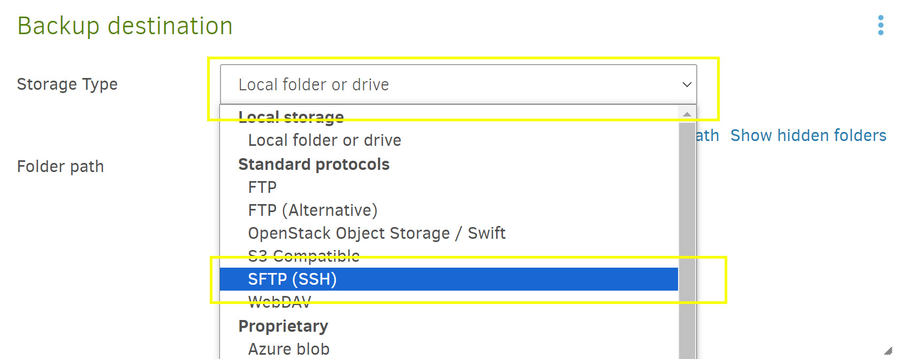

## Using Duplicati to backup files to keychain backup

Before running this setup doc, make sure the USB drive is inserted into your Keychain backup device.

Download and install Duplicati for your platform: [https://duplicati.com/download](https://duplicati.com/download)

-----

1. Click add backup.

2. On Add a new backup screen, make sure Configure a new backup is selected and click Next.

3. On General backup settings, give it a name. Enter a good passphrase for the encryption, repeat it and click Next.

4. On Backup destination, click the storage type dropdown and select SFTP(SSH).

5. Then put in the hostname or ip address of the keychain backup in the server box. Then put 2222 in the port box. For Path on server put /media/usbdrive. Then enter the username and password for the raspberry pi, that you picked when setting it up. Click Test connection.

6. It will ask to trust the host, click yes. It will pop up a dialog box say connection was successful, click ok. Then click Next.

7. On the Source Data screen, select the folders/files you want backed up. Then click Next.

8. On the Schedule page, setup when and how often the backup should run. Keep in mind when your keys will be hanging up and the usb drive will be plugged in.

9. On the general options page, make sure Backup retention is set to Keep all backups. Then click save.

