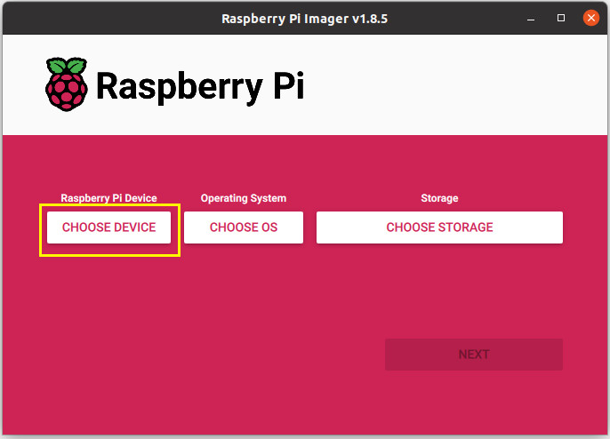

# Flashing the keychain backup image
Prerequisites:

Raspberry pi imager application installed, get it from here: https://www.raspberrypi.com/software/

SD card inserted into the computer

Image downloaded from our release page.

-----------

1. Run the pi imager application.
2. Click the Choose Device button.

3. Select your raspberry pi. I have a raspberry pi 3a+ so I've selected Raspberry Pi 3.

4. Back at the main screen click Choose OS.

5. Scroll down to the bottom and select Use Custom.

6. Browse to the image file downloaded from our release page and click open.

9. Click Choose storage button.

10. Select the SD card you have inserted.

12. Click the Next button.

13. A Customise OS screen will pop up. Click edit settings.

14. On the General tab, Enter a hostname for the raspberry pi. This will make it easier to connect to later on. Also put in a username and password. You will need this later, so make a note of these values. Then set the wifi ssid and password.

15. Click on the Services tab. Make sure Enable SSH is checked and Use password authentication is selected. Then click the save button.

16. Click on Yes, apply settings.

17. A warning will pop up about overwriting data, verify the right device is selected and click Yes.

18. Once the Write has finished, remove the SD card from the computer and insert it into the Raspberry PI. You are now ready to do the hardware setup, [Hardware Assembly](assembly.md).
