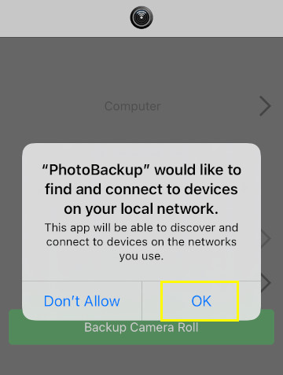
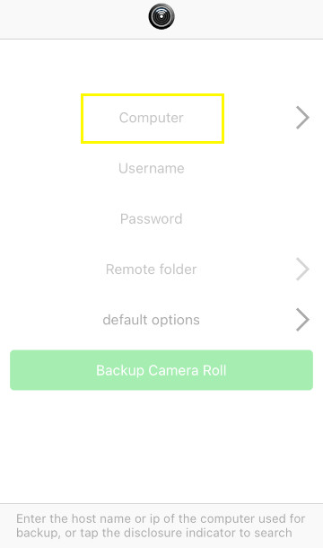
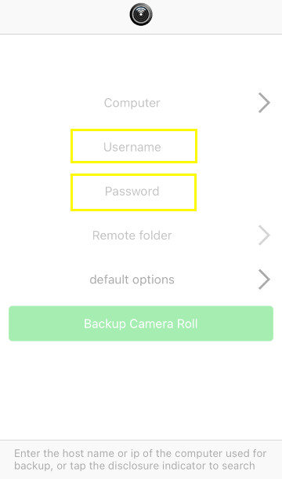
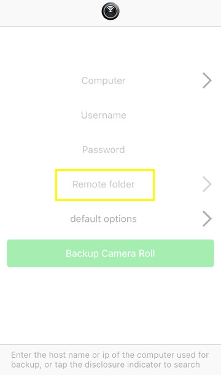
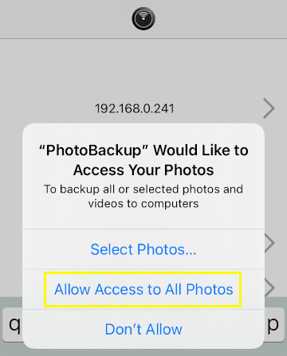
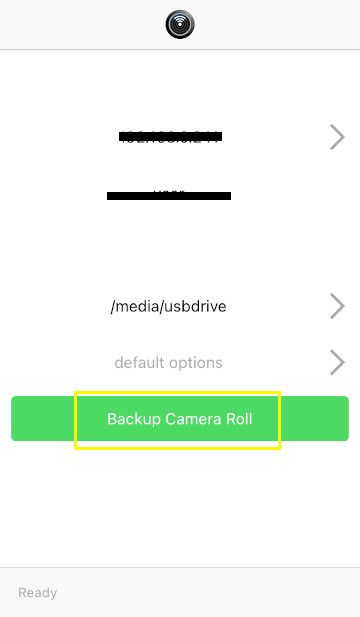

### Setting up syncing for iPhone
----

Steps:

1. Install PhotoBackup from the app store (https://apps.apple.com/us/app/photobackup-backup-photos-and-videos-via-rsync/id945026388)

2. Allow PhotoBackup to connect to devices on your local network.

3. Click on Computer and enter in the hostname or IP address of your keychain backup device.

4. Enter your SSH credentials for your raspberry pi.

5. For remote folder enter /media/usbdrive

6. Allow PhotoBackup to access your photos.

7. Click Backup Camera Roll to backup your photos and videos to keychain backup.

