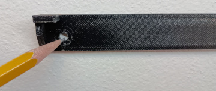
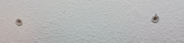
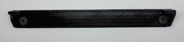
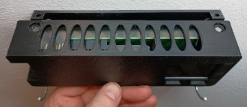
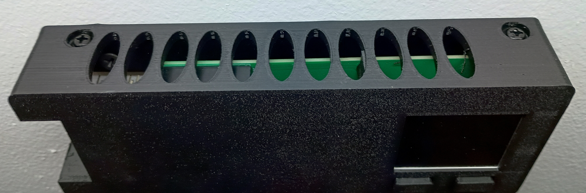
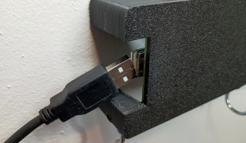
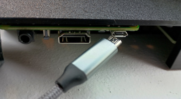
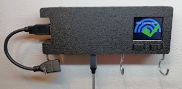

### Mounting the keyholder on the wall

-------------------

Tools needed:

* Pencil
* Drill
* 3/8" drill bit
* Screwdriver

Steps:

1. Place the wall bracket on the wall and mark screw holes with a pencil.

2. Remove the wall bracket and drill out the holes with a 3/8" drill bit.

3. Insert dry wall screw holders into the holes.

4. Align wall bracket with screw holes and screw 2 wall mounting screws, to secure it to the wall.

5. Align holes on top of the case with the holes on top of the wall bracket.

6. Screw in 2 - M4x5mm screws through the top of the case into the top of the wall bracket.

7. Connect strain relief USB extension cord to the side port.

8. Plug in the power to the raspberry pi by plugging in the USB cord to the micro USB port on the bottom of the pi's board. It will take up to a minute for the pi to turn on and the screen to show status messages.

